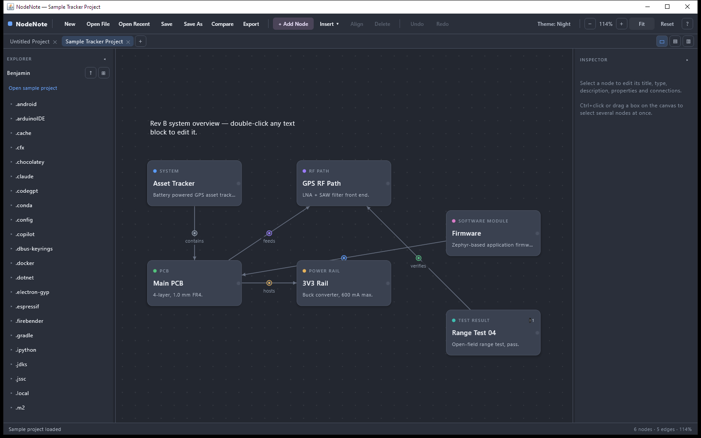
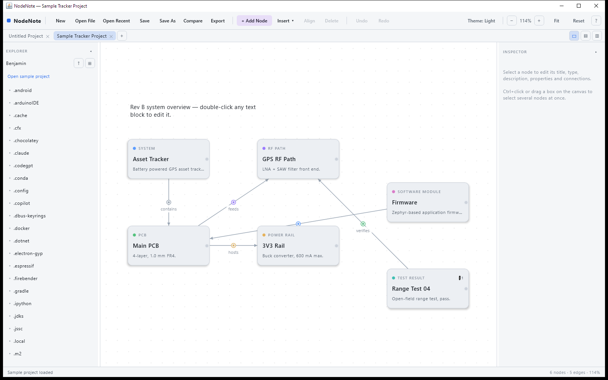
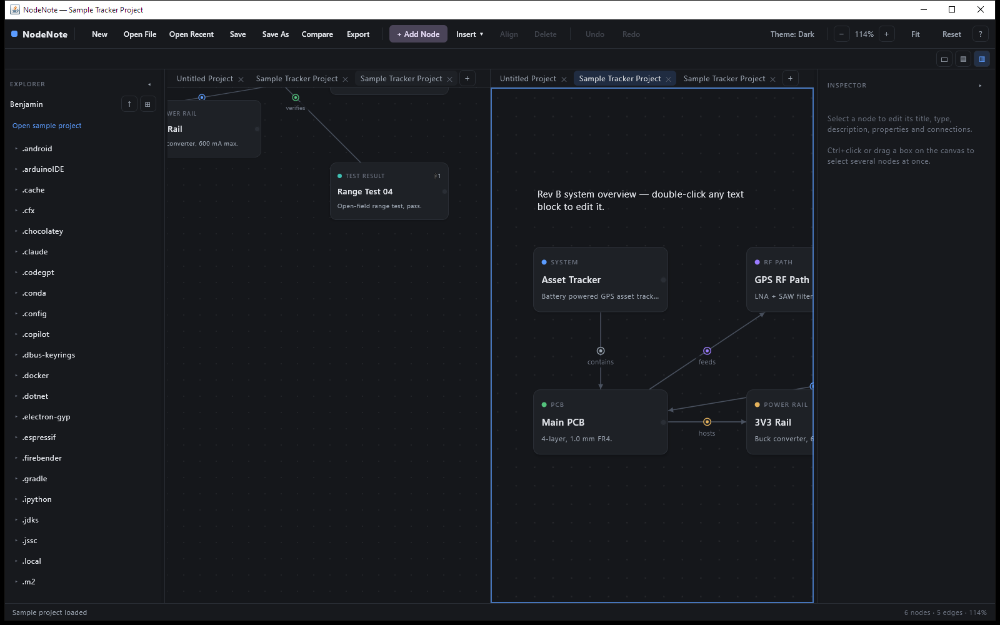

<div align="center">

# NodeNote

**A node-based system & process documentation suite — build, document, edit, compare, and share diagrams.**
Built with Kotlin + Compose Multiplatform for Windows, macOS, and Linux.




</div>

Place nodes on an infinite dot-grid canvas, connect them with typed connections, annotate with text
and images, and save everything as one human-readable JSON file. NodeNote works for **physical systems**
(devices, PCBs, RF paths, power rails), **software architecture** (services, APIs, databases, queues),
**human-data flows** (surveys, forms, interviews), and **media production** (clips, scripts, timelines) —
plus any **custom types** you define.

## Download

Prebuilt installers are on the **[Releases page](https://github.com/DeltaPlusProtoTyping/NodeNote/releases/latest)** — no build tools or Java needed, the runtime is bundled:

| Platform | File |
|---|---|
| Windows | `NodeNote-<version>.msi` |
| macOS (Apple Silicon) | `NodeNote-<version>.dmg` |
| Linux (Debian / Ubuntu / Mint) | `nodenote_<version>_amd64.deb` |

Installers are unsigned, so on first launch you'll see a one-time prompt: Windows SmartScreen → **More info → Run anyway**; macOS → right-click the app → **Open**.

## Screenshots

<div align="center">

**Light theme**


**Split view (two projects side by side, dark theme)**


</div>

## Features

**🗂️ Workspace**
- **File explorer** — browse folders and open projects; opening a project points the explorer at its folder.
- **Tabs** — multiple projects open at once; switch, close, and see a `•` on tabs with unsaved changes.
- **Split view** — single / stacked / side-by-side, with an independent canvas and its own tab strip per pane.

**🧩 Nodes & connections**
- ~30 built-in **node types** grouped into columns — General, Hardware, Software, Data, Input, Video, Infrastructure, External — plus **custom types** you create (name + color), saved with the project.
- **Typed connections** (Power, Data, Signal, API Call, Event, Response, Sequence, …) shown as a colored node at each edge's midpoint, with optional labels. Custom connection types too.
- **Recently used types** float to the top of every type menu.
- Drag from a node's edge port to another node to connect, or use *Start connection*.

**📝 Document**
- Inspector for title, type, description, free-form key/value properties, and per-connection type/label.
- **Attachments** — embed images, files, and text snippets per node (self-contained in the JSON).
- **Canvas elements** — free-floating text blocks and images via *Insert*.
- Bottom **notes panel** for longer notes on the selected node.

**✏️ Edit**
- Multi-select (Ctrl+click, box-select), group drag, **Align** to grid, **Duplicate**, copy/cut/paste.
- **Undo / redo** (up to 50 steps), inline rename, arrow-key nudge.

**🎭 Themes** — **Dark**, **Night**, and **Light**, applied app-wide; your choice is remembered.

**📤 Export & share** — a PNG export studio with live preview: crop (view / all / selection), 1–3× resolution, dark/light render theme, transparent or solid background, a draggable legend and title block, and saved presets. Or **copy straight to the clipboard**.

**🔍 Compare** — diff the open project against any file: nodes/connections added, removed, or changed (read-only; the open project is never touched).

## Keyboard shortcuts

| Action | Shortcut |
|---|---|
| Save | `Ctrl+S` |
| Undo / Redo | `Ctrl+Z` / `Ctrl+Y` (or `Ctrl+Shift+Z`) |
| Copy / Cut / Paste | `Ctrl+C` / `Ctrl+X` / `Ctrl+V` |
| Duplicate / Select all | `Ctrl+D` / `Ctrl+A` |
| Delete selection | `Delete` |
| Nudge selection | Arrow keys (`Shift` = one grid step) |
| Zoom in / out / reset | `Ctrl+=` / `Ctrl+-` / `Ctrl+0` |
| Pan canvas | Middle-mouse drag |
| Add node at cursor | Double-click empty canvas |
| Shortcut cheat sheet | `F1` |

## Build & run from source

Requirements: **JDK 17+** (the Gradle wrapper fetches everything else).

```bash
./gradlew :shared:run                 # run the desktop app
./gradlew :shared:createDistributable # portable app folder (bundled runtime)
./gradlew :shared:packageMsi          # Windows installer  (.deb / .dmg on Linux / macOS)
```

Releases are built automatically: pushing a `v*` tag runs a GitHub Actions workflow
(`.github/workflows/release.yml`) that builds the `.msi`, `.dmg`, and `.deb` on Windows, macOS,
and Linux runners and attaches them to a Release.

## Project structure

```
shared/src/commonMain/kotlin/com/nodenote/
  App.kt                 # shared entry point
  model/                 # Project / Node / Edge / type catalog — @Serializable data classes
  state/
    AppState.kt          # one open document: project, canvas, selection, undo, dialogs
    Workspace.kt         # multi-document: tabs, file explorer, split layout
  ui/                    # MainScreen, TopBar, TabBar, FileExplorer, GraphCanvas, NodeCard,
                         # InspectorPanel, Export/Compare/Shortcuts/NewType dialogs, Widgets
  storage/               # JSON serializer + ProjectStorage (expect) + PNG/clipboard/presets
  theme/AppTheme.kt      # Dark / Night / Light palettes + per-type colors
shared/src/desktopMain/  # main.kt window + desktop actuals (file dialogs, PNG, clipboard)
shared/src/iosMain/      # MainViewController + iOS actuals
```

The canvas transform is `screen = world * (zoom * density) + pan`; node positions are stored in
density-independent world units, so projects lay out identically across displays and platforms.

## Roadmap

- Node resize handles on the canvas (width/height are already in the model).
- Confirm-on-discard when closing a tab with unsaved changes.
- Edit edge label/type directly on the canvas midpoint node.
- SVG export; side-by-side visual diff in Compare.
- iOS app project (Xcode) + document picker — the `shared` module already targets iOS.

## Tech notes

- Minimal dependencies: Compose Multiplatform + kotlinx.serialization. No DB, no DI framework.
- Projects are plain, diff-friendly JSON; custom types and embedded media travel inside the file.
